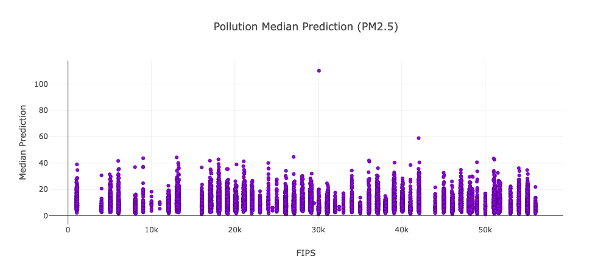
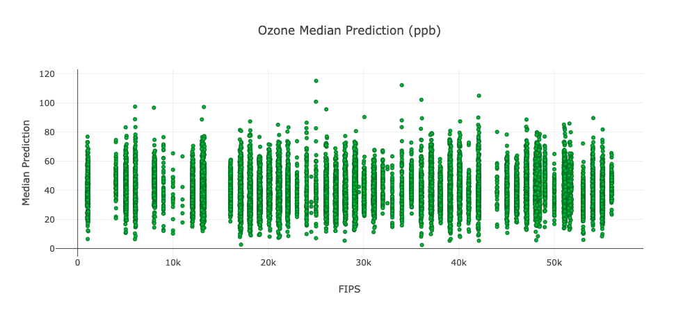
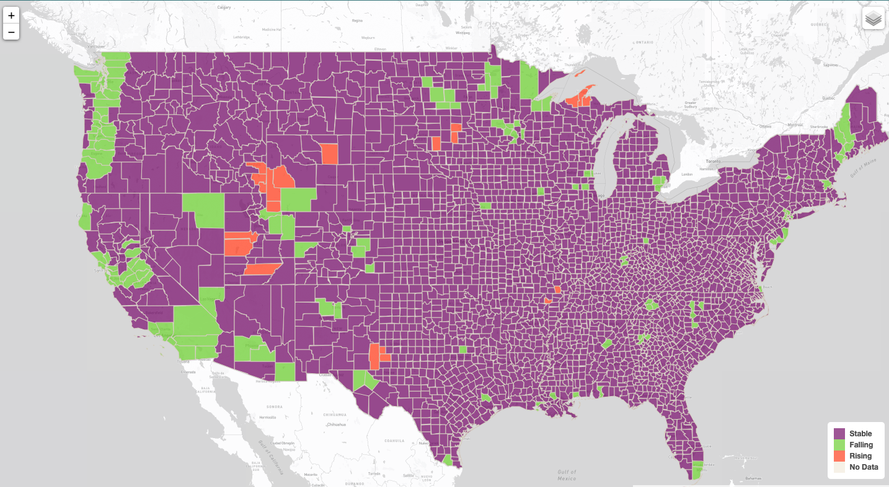

# Cancer Incidence Dashboard

This Cancer Incidence Dashboard was developed to visualize the results from the [environmental_pollutants_cancer_incidence](https://github.com/katiarp/environmental_pollutants_cancer_incidence) project. This web application allows you to observe scatterplots that show the preliminary analysis of the pollution and ozone data, a sample of our model dataset, interactive charts, and the interactive map showing our results and predictions. 

The interactive map displays the actual trend from our dataset and the results of our model. The model was then applied to a different 14-year time slice from 2003 to 2016 predicting cancer incidence rates for counties where cancer incidence data was non-existent. The map displays actual trend, model prediction, and future trend layers and allows you to turn them on or off.

  
The code for the interactive map can be found in this [repository](https://github.com/katiarp/visualization_map)
